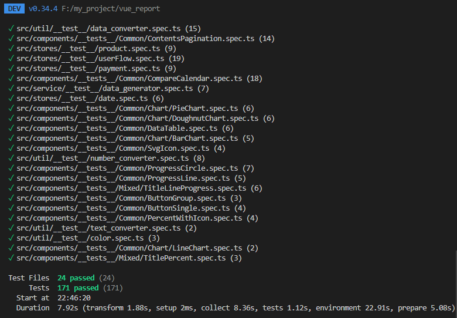
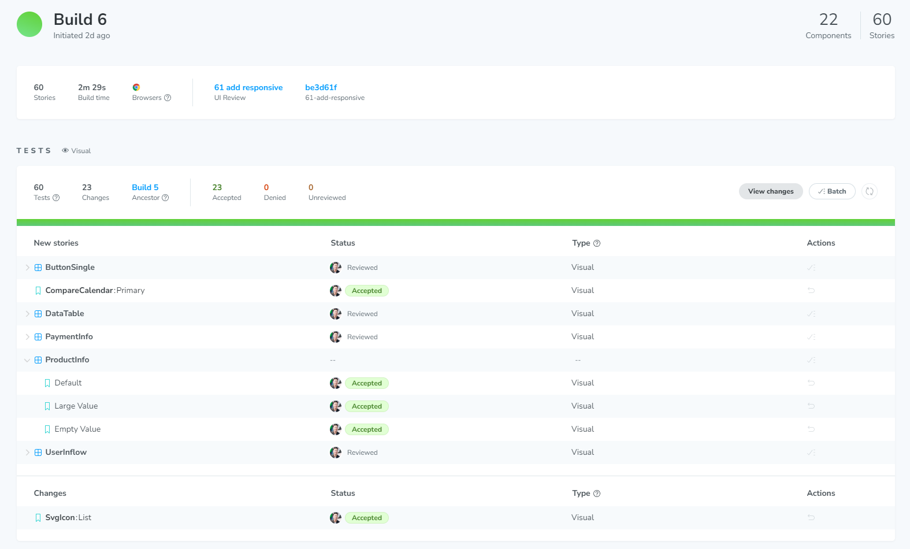
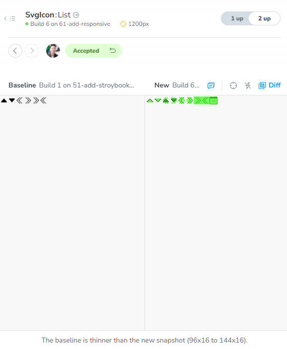

# vue_report
Vue3를 활용한 더미데이터로 이루어진 리포트 페이지


[프로젝트 구성 자세히보기](#detail)

# used
- pnpm
- TypeScript
- Vite + Vue3 + pinia
- Vitest
- Cypress
- storybook(with chromatic)
- Eslint
- prettier
- luxon
- sass
- chart.js

## Project Setup

```sh
pnpm install
```

### Compile and Hot-Reload for Development

```sh
pnpm run dev
```

### Run Unit Tests with [Vitest](https://vitest.dev/)

```sh
pnpm run test:unit
```

### Run End-to-End Tests with [Cypress](https://www.cypress.io/)

```sh
pnpm run test:e2e:dev
```

# Detail
vue_report는 카드 레이아웃과 공통 컴포넌트를 통합하고 있어, 사용자에게 깔끔한 인터페이스를 제공합니다.\
각 컴포넌트는 3가지 종류로 구성되어 있습니다
- [Common(공통 컴포넌트)](https://651c102a27756b1f8a3bf1ab-oxrlkwwuiy.chromatic.com/?path=/docs/stories-components-common-buttongroup--docs)
- [Mixed(확장된 공통 컴포넌트)](https://651c102a27756b1f8a3bf1ab-oxrlkwwuiy.chromatic.com/?path=/docs/stories-components-mixed-titlelineprogress--docs)
- [`Views`(View에서 사용되는 컴포넌트)](https://651c102a27756b1f8a3bf1ab-oxrlkwwuiy.chromatic.com/?path=/docs/stories-components-dashboard-cardcounter--docs)

공통 컴포넌트는 다양한 확장 가능성을 갖추고 있어, 여러 환경과 조건에서 유연하게 활용할 수 있습니다.\
[Views] 디렉토리의 명칭을 사용한 별도 컴포넌트는 특정 뷰에서만 필요한 독특한 기능을 제공합니다.

chart.js 라이브러리를 활용하여, 다양한 차트 컴포넌트를 구현하였고,\
luxon 라이브러리를 이용하여, 지난 7일에서 91일 간의 데이터를 선택하고 비교할 수 있는 달력 기능도 추가하였습니다.\
[Chart](https://651c102a27756b1f8a3bf1ab-oxrlkwwuiy.chromatic.com/?path=/docs/stories-components-common-chart-barchart--docs)\
[Calendar](https://651c102a27756b1f8a3bf1ab-oxrlkwwuiy.chromatic.com/?path=/docs/stories-components-common-comparecalendar--docs)

화면 구성은 관심사의 분리 원칙을 따르고 있습니다.\
vue 파일에서는 scss를 활용하여 UI에 집중하고, 데이터 관리는 pinia에서 책임지고 있습니다.\
[components](https://github.com/city-kim/vue_report/tree/main/src/components/Common)\
[stores](https://github.com/city-kim/vue_report/tree/main/src/stores)

util 디렉토리에서는 UI와 데이터를 연결하며, 데이터 변형과 조작을 담당하고 있습니다.\
여기에는 UI의 텍스트나 값의 표현을 변경하거나 pinia의 데이터의 그룹화, 합산, 재귀 연산을 하는 공통 함수들이 포함되어 있습니다.\
[utils](https://github.com/city-kim/vue_report/tree/main/src/util)

테스트는 vitest를 사용하여 유닛 테스트를, cypress를 활용하여 기능 테스트, storybook의 chromatic을 통해 시각화 테스트를 진행하였습니다.\
이렇게 테스트의 관심사를 분리하여, 더 효율적이고 집중된 테스트 환경을 구축하였습니다.

unit test\


cypress\
https://github.com/city-kim/vue_report/assets/26377698/915634d1-3ebf-4e0d-a678-67871379aeba
https://github.com/city-kim/vue_report/assets/26377698/4ab243e0-468e-4204-baba-352d6d26b995

시각화 테스트\



flex와 grid 기반의 반응형 디자인이 적용되어 있어, 모바일에서 데스크톱까지 다양한 화면 크기에 최적화되어 사용자에게 일관된 경험을 제공합니다.


